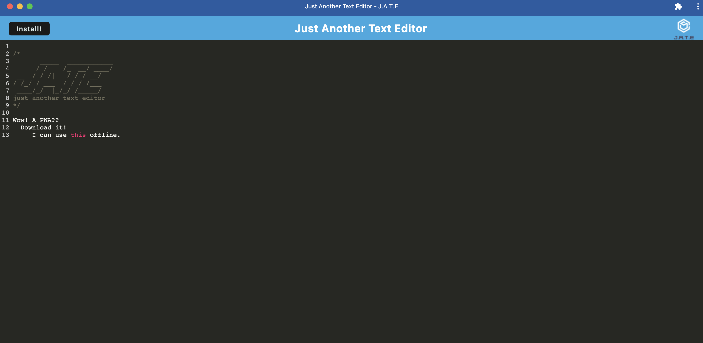

# text_editor
A Progressive Web application that allows a user to edit text. This apps was created with the help Webpack and service workers. 

## User Story
As an application user,
I want to edit and save text in a stylish text editor on and off the web. I want to download the text editor for use on my desktop and in case disconnection from the internet occurs

## Features
This app can be downloaded from Heroku to use as an offline text editor. 
Users can edit Text and it will save for the users next use.
Featuring a command line like interface
Downloadable and usable without internet.
Service workers cache all of the pages data for later use

## Deployed App
https://jellyfishtext.herokuapp.com/

## Screenshots

## Installation 

Clone the repository,
run npm i to install all of your dependencies,
run npm start on your server file to begin your app,
The text editor will be live on http://localhost:3000/. 

## License
This project uses the MIT license.

## Questions
If you have any questions please contact me through github or email.
Github: https://github.com/Niccatania

Email: niccatania6@gmail.com

